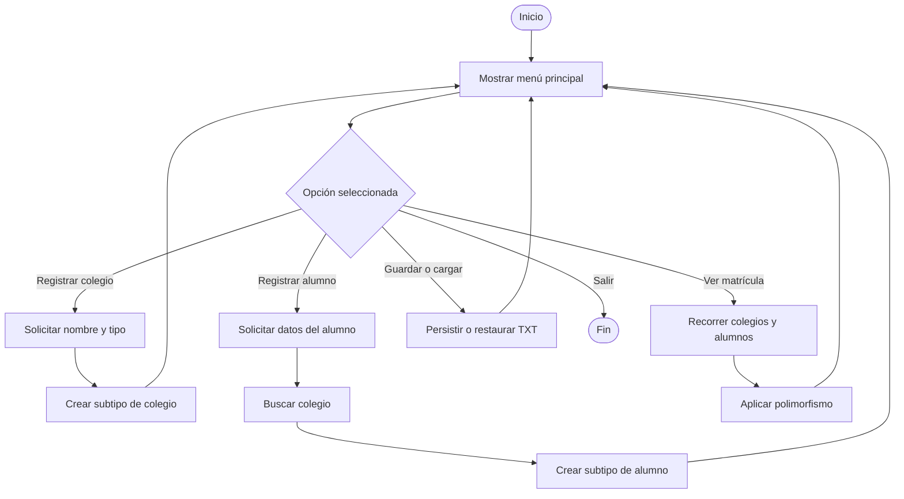

# Diagrama de Actividad del Flujo Principal

```mermaid
flowchart TD
    A([Inicio]) --> B[Mostrar menú principal]
    B --> C{Opción seleccionada}
    C -->|Registrar colegio| D[Solicitar nombre y tipo]
    D --> E[Crear subtipo de colegio]
    E --> B
    C -->|Registrar alumno| F[Solicitar datos del alumno]
    F --> G[Buscar colegio]
    G --> H[Crear subtipo de alumno]
    H --> B
    C -->|Ver matrícula| I[Recorrer colegios y alumnos]
    I --> J[Aplicar polimorfismo]
    J --> B
    C -->|Guardar o cargar| K[Persistir o restaurar TXT]
    K --> B
    C -->|Salir| L([Fin])
```

