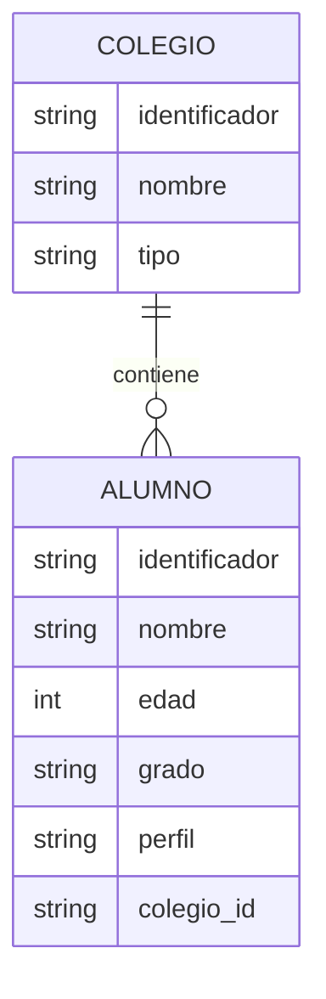

# Mapa de Entidades
**Proyecto**: Taller 6 - Gestión Escolar con POO  
**Fecha**: 2026-04-21  
**Fase PDCO**: PLAN  
**Skill activa**: 01-requirements

## Entidades del sistema

### Entidad: Colegio
- **Descripción**: Institución académica que agrupa alumnos y define una matrícula base.
- **Atributos clave**: `identificador`, `nombre`, `alumnos`
- **Relaciones**: tiene muchos alumnos
- **Use cases asociados**: UC-001, UC-004, UC-005

### Entidad: Alumno
- **Descripción**: Estudiante asociado a un colegio y a un perfil académico.
- **Atributos clave**: `identificador`, `nombre`, `edad`, `grado`, `colegio_id`
- **Relaciones**: pertenece a un colegio
- **Use cases asociados**: UC-002, UC-003, UC-005

### Entidad: RepositorioInstitucional
- **Descripción**: Contrato de persistencia para guardar y recuperar colegios y alumnos.
- **Atributos clave**: fuente de datos persistida
- **Relaciones**: depende de Colegio y Alumno
- **Use cases asociados**: UC-005

## Diagrama ER

