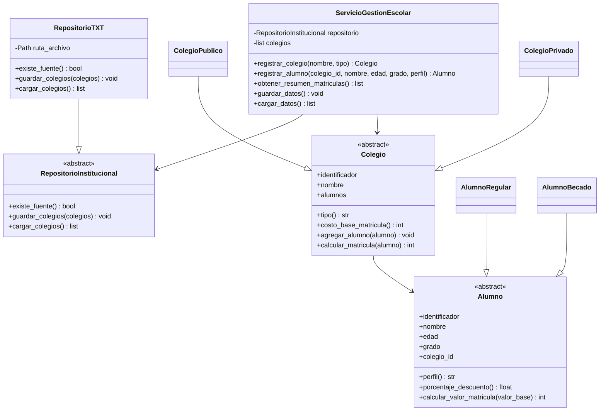

# Diagrama de Clases

```mermaid
classDiagram
    class RepositorioInstitucional {
        <<abstract>>
        +existe_fuente() bool
        +guardar_colegios(colegios) void
        +cargar_colegios() list
    }

    class RepositorioTXT {
        -Path ruta_archivo
        +existe_fuente() bool
        +guardar_colegios(colegios) void
        +cargar_colegios() list
    }

    class ServicioGestionEscolar {
        -RepositorioInstitucional repositorio
        -list colegios
        +registrar_colegio(nombre, tipo) Colegio
        +registrar_alumno(colegio_id, nombre, edad, grado, perfil) Alumno
        +obtener_resumen_matriculas() list
        +guardar_datos() void
        +cargar_datos() list
    }

    class Colegio {
        <<abstract>>
        +identificador
        +nombre
        +alumnos
        +tipo() str
        +costo_base_matricula() int
        +agregar_alumno(alumno) void
        +calcular_matricula(alumno) int
    }

    class ColegioPublico
    class ColegioPrivado

    class Alumno {
        <<abstract>>
        +identificador
        +nombre
        +edad
        +grado
        +colegio_id
        +perfil() str
        +porcentaje_descuento() float
        +calcular_valor_matricula(valor_base) int
    }

    class AlumnoRegular
    class AlumnoBecado

    RepositorioTXT --|> RepositorioInstitucional
    ColegioPublico --|> Colegio
    ColegioPrivado --|> Colegio
    AlumnoRegular --|> Alumno
    AlumnoBecado --|> Alumno
    ServicioGestionEscolar --> RepositorioInstitucional
    ServicioGestionEscolar --> Colegio
    Colegio --> Alumno
```

