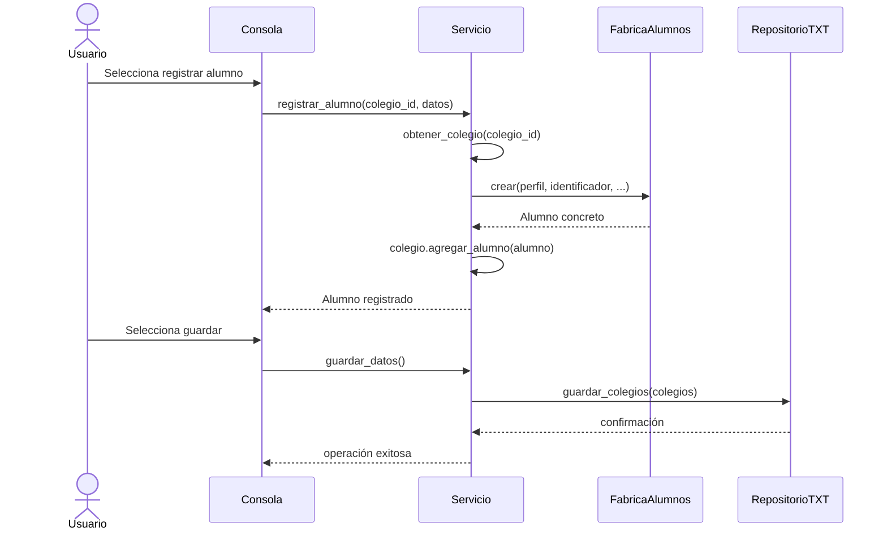

# Diagrama de Secuencia - Registrar Alumno y Guardar Datos

```mermaid
sequenceDiagram
    actor Usuario
    participant Consola
    participant Servicio
    participant Fabrica as FabricaAlumnos
    participant Repo as RepositorioTXT

    Usuario->>Consola: Selecciona registrar alumno
    Consola->>Servicio: registrar_alumno(colegio_id, datos)
    Servicio->>Servicio: obtener_colegio(colegio_id)
    Servicio->>Fabrica: crear(perfil, identificador, ...)
    Fabrica-->>Servicio: Alumno concreto
    Servicio->>Servicio: colegio.agregar_alumno(alumno)
    Servicio-->>Consola: Alumno registrado

    Usuario->>Consola: Selecciona guardar
    Consola->>Servicio: guardar_datos()
    Servicio->>Repo: guardar_colegios(colegios)
    Repo-->>Servicio: confirmación
    Servicio-->>Consola: operación exitosa
```

